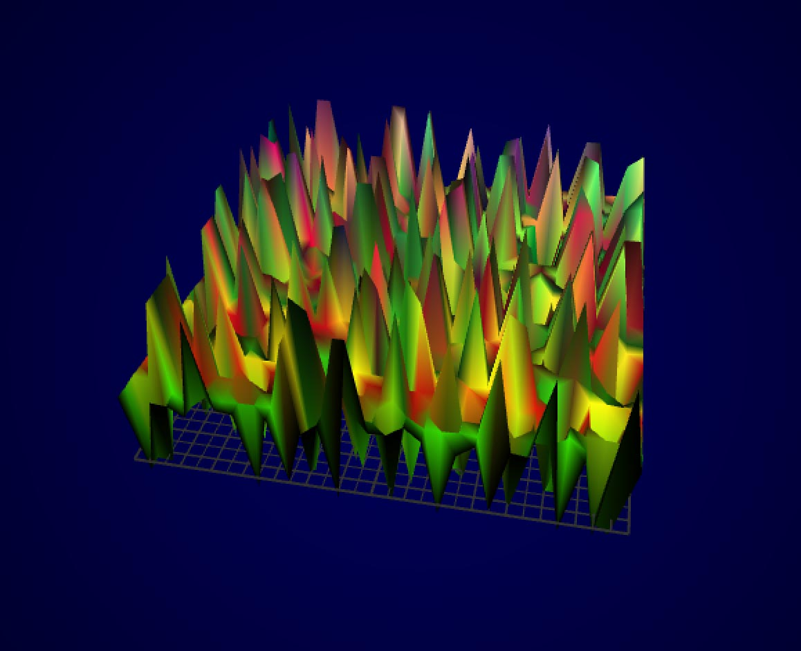
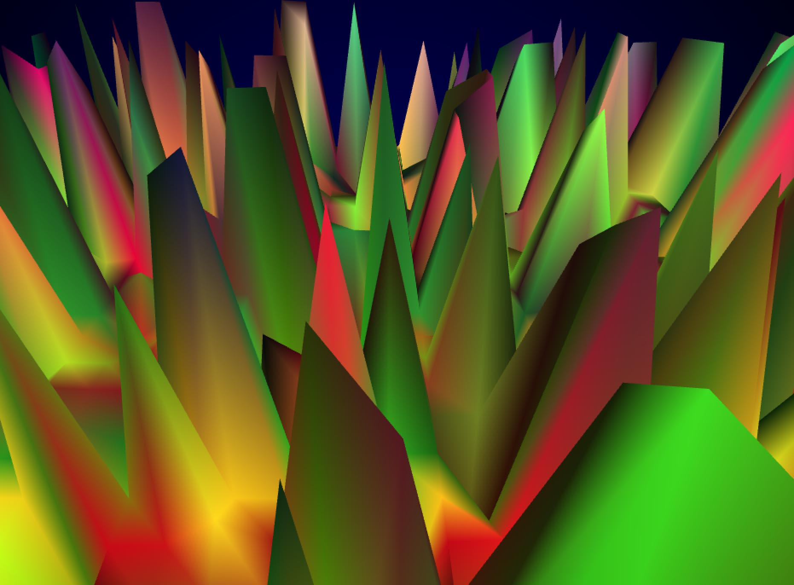

##Landscape
This project generates a mountainous landscape based on perlin noise combined with the elapse time of the program. The color is based mainly on the y position of each vertex giving the landscape a sunset-y feel.

The mountain height is determined by perlin noise generated fromt the elapsed time.The color is changed according to the height of each mountain. The colors are in a red/green heavy  range to simulate a sunset. 
    for (int y=0; y<height; y++) {
        for (int x=0; x<width; x++) {
            int i = x + width * y;
            ofPoint p = mesh.getVertex( i );
            
            float value = ofNoise( x * 1, y * 15, time * 0.5 );
            
            p.z = value * 15;
            mesh.setVertex( i, p );
            
            mesh.setColor( i,
                            ofColor( (value*y)*101,(value*y)*400,(value*y)*5) );
    
        }
    }

